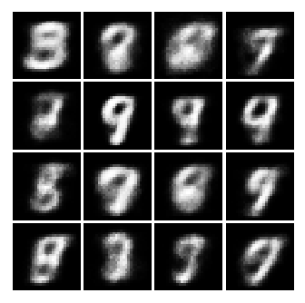
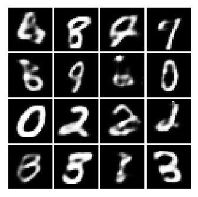
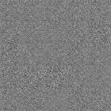

# Variational Auto-Encoder with TensorFlow & slim

## Requirements
* TensorFlow 1.1.0 or greater (?)
* opencv (for `generate.py`)
* numpy

## Training
### editing train.sh
* Set the "TRAIN_DIR" (where to save checkpoint) to path you want
* Set the hyper-parameters

#### train.sh
```shell
# Working directory
WORKING_DIR=$HOME/projects

# Where the training (fine-tuned) checkpoint and logs will be saved to.
TRAIN_DIR=$WORKING_DIR/vae.tensorflow.slim/exp1

CUDA_VISIBLE_DEVICES=0 \
python train.py \
    --train_dir=${TRAIN_DIR} \
    --batch_size=64 \
    --max_steps=100000 \
    --save_steps=5000 \
```

### run ./train.sh
```shell
$ ./train.sh
```
* You can use tensorboard for monitoring loss and generated images
```shell
$ tensorboard --logdir=exp1
```

## Generate images
### generate.sh
```shell
# Working directory
WORKING_DIR=$HOME/projects

# Where the training (fine-tuned) checkpoint and logs will be saved to.
TRAIN_DIR=$WORKING_DIR/vae.tensorflow.slim/exp1

batch=$1

CUDA_VISIBLE_DEVICES=0 \
python image_translate.py \
    --checkpoint_path=${TRAIN_DIR} \
    --checkpoint_step=-1 \
    --batch_size=$batch \
    --seed=12345 \
    --save_step=1000 \

convert -delay 30 -loop 0 *.jpg generated_images.gif
```

### run ./generate.sh
```shell
$ ./generate.sh batch_size (the number of images you want)
```

## Results
### MNIST datasets
Epoch 1


    
Epoch 100



Gif



## References
#### Papers
* Diederik P. Kingma, Max Welling. Auto-Encoding Variational Bayes.
  [arXiv: 1312.6114](https://arxiv.org/abs/1312.6114)
* Carl Doersch. Tutorial on Variational Autoencoders.
  [arXiv: 1606.05908](http://arxiv.org/abs/1606.05908)

#### Blogs
* Tutorial - What is a variational autoencoder? 
  (<https://jaan.io/what-is-variational-autoencoder-vae-tutorial>)
* Variational Autoencoder: Intuition and Implementation 
  (<http://wiseodd.github.io/techblog/2016/12/10/variational-autoencoder>)


## My presentation file (DeepLAB in ModuLabs)
* <http://www.modulabs.co.kr/DeepLAB_library/13347>


## Author
  Il Gu Yi
